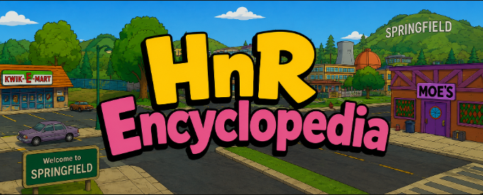

 

 

 

## 📖 About

This is a self-contained, **byte-level and runtime-level** guide to the file formats, data structures, classes, and subsystems of *The Simpsons: Hit & Run* — the open-world driving-and-platforming game built by **Radical Entertainment** on their **Pure3D** engine and **RadCore** runtime. It follows one discipline throughout: understand the game the way its authors did, and change it with confidence — from swapping a single texture, to rebuilding a car's handling, to retuning a mission, to tracing a value from the HUD down to the byte it was read from on disk.

Everything here is grounded in the **retail PC data set** shipped with the game and in the code of the retail executable (`Simpsons.exe`). Wherever a claim describes bytes on disk, it was produced by actually parsing the shipped files with the tools in [`tools/`](tools/); wherever a claim describes the running game — a class, a base-class relationship, a vtable — it comes from the **RTTI-verified data set** extracted directly from `Simpsons.exe` and carried by the companion **[DonutsSDK](../DonutsSDK)**.

> **The rule:** nothing is asserted on-disk that the parser cannot reproduce, and nothing about the class model is asserted that the executable's own RTTI does not contain. It is written **format-first and mechanism-first**, and the code is deliberately **toolkit-agnostic** — it reads and writes raw bytes, so the knowledge outlives any single program.

## 🧭 How to read this book

The work is split into a **Glossary** (terminology, the master chunk-ID table, an extension index, and a file-by-file catalogue of the entire game) followed by **chapters** that build from first principles — a single Pure3D chunk header — all the way up to the running game.

> **Every chapter is a hub plus focused deep-dive pages.** The chapter file (e.g. `C1-Pure3D-Container-Model/C1-Pure3D-Container-Model.md`) is the overview and the map; inside the same folder, numbered pages (`01-….md`, `02-….md`, …) each take a *single* mechanism and answer four questions: **what it is, how it works, why it's built that way, and what happens if you bend it — the right way or the wrong way.** A chapter runs 5–12 such pages.

### Confidence markers

Because much of this is reverse-engineered, every non-obvious claim is tagged so you always know how much weight it bears:

| Marker | Meaning |
|:--:|---|
| ✅ **Verified** | reproduced directly from retail bytes (by the parser in `tools/`) or read from the executable's own RTTI (via the DonutsSDK data set). Reproducible on your own copy. |
| 🟡 **Reasoned** | a well-supported inference about *intent*, *mechanism*, or a *name* that fits all observed evidence (often aligned with public Pure3D docs) but is not a byte-for-byte proof in this data set. |
| ⏳ **Open** | known to exist, not yet fully decoded; the boundary of current knowledge is stated explicitly rather than hidden. |

### What "verified" rests on, concretely

Two independent, reproducible evidence bases sit under this book:

1. **The shipped files.** `tools/p3d_rcf_scan.py` walks every `.p3d` and `.rcf` in the retail tree. Its census — **1,941 plain Pure3D files (0 parse failures) plus 28 compressed `P3DZ` files, 179 distinct chunk IDs** — is the source of the master chunk table and of every on-disk structural claim.
2. **The executable's RTTI.** DonutsSDK ships `data/shar_dumps.csv`: **1,207 RTTI-confirmed classes and 3,924 base-class relationships** read straight out of `Simpsons.exe`'s `_RTTIBaseClassDescriptor` records. Every runtime-class claim traces to a row there — and the **[SAHRDiag](../SAHRDiag)** tool re-derives them on demand (965 → **1,131** confirmed vtables).

Member offsets, function addresses, and singleton pointers that neither base has proven are marked ⏳ **Open** and never invented.

## 📗 Glossary

| Page | Contents |
|---|---|
| [📂 Glossary/README](Glossary/README.md) | How the glossary is organised; the "identify an unknown file" workflow |
| [🔤 Terminology](Glossary/terminology.md) | Every acronym and concept: Pure3D, chunk, container/leaf, RadCore, RCF, Radical hash, CON/MFK, RSD, Bink, Scrooby, choreography, vtable, RTTI, DSG… |
| [🧩 Chunk IDs](Glossary/chunk-ids.md) | Master table of all **179** chunk identifiers observed in the retail data set, each with role and occurrence count |
| [🗂️ Extensions](Glossary/extensions.md) | Extension → format → chapter map, plus the "identify an unknown file" decision tree and a portable identifier |
| [📇 File Catalogue](Glossary/file-catalogue.md) | A file-by-file inventory of the entire retail data set: the ten `.rcf` archives and the loose `art/`, `scripts/`, `sound/`, `movies/` trees |

## 📚 Chapters

> **Every chapter title below is a clickable link to its hub page.**

### 🧱 Part I — Foundations & the Container Model

*Everything downstream depends on Part I. Read C1–C4 in order; the rest of the book assumes them.*

| # | Chapter | What it covers |
|:--:|---|---|
| **C1** | [The Pure3D Container Model](C1-Pure3D-Container-Model/C1-Pure3D-Container-Model.md) | the chunk tree, the 12-byte header, the header-size/chunk-size distinction (container vs. leaf), walking, dumping, editing, and repacking *any* Pure3D file |
| **C2** | [Identifiers & Radical Hashing](C2-Identifiers-And-Hashing/C2-Identifiers-And-Hashing.md) | how names become 32-bit numbers, the Radical string hash used by `radLoadObject` and the RCF directory, chunk-ID families, and name recovery |
| **C3** | [RCF Archives & the Virtual File System](C3-RCF-Archives-VFS/C3-RCF-Archives-VFS.md) | the `RADCORE CEMENT LIBRARY` container, its hash-addressed directory, and how the ten shipped archives back the loose file tree |
| **C4** | [Byte-Level Toolcraft](C4-Byte-Level-Toolcraft/C4-Byte-Level-Toolcraft.md) | bounded readers/writers, tree dumpers, hex-diffing, and the reverse-engineering workflow used to produce this book |

### 🎨 Part II — Textures, Shaders & Geometry

| # | Chapter | What it covers |
|:--:|---|---|
| **C5** | [Textures & Images](C5-Textures-Images/C5-Textures-Images.md) | `0x00019000/1/2` — the Texture→Image→Image-Data hierarchy and embedded PNG/BMP payloads |
| **C6** | [Shaders & Materials](C6-Shaders-Materials/C6-Shaders-Materials.md) | `0x00011000` + FourCC params — how a drawable binds textures and render state |
| **C7** | [Meshes & Primitive Groups](C7-Meshes-Primitive-Groups/C7-Meshes-Primitive-Groups.md) | `0x00010000` family — vertex streams, positions/UVs, colours, and index buffers |
| **C8** | [Skeletons, Skinning & Locators](C8-Skeletons-Locators/C8-Skeletons-Locators.md) | joints, skin weights, and the locator groups that pin gameplay to geometry |
| **C9** | [Geometry Import/Export](C9-Geometry-IO/C9-Geometry-IO.md) | exporting to OBJ/glTF and rebuilding vertex/index buffers |

### 🌆 Part III — The World & Scene

| # | Chapter | What it covers |
|:--:|---|---|
| **C10** | [The Scenegraph](C10-Scenegraph/C10-Scenegraph.md) | `0x03F0xxxx` — roots, branches, transforms, drawables, and sort order |
| **C11** | [Collision & Intersect](C11-Collision-Intersect/C11-Collision-Intersect.md) | `0x00120xxx`/`0x00121xxx` — the collision-volume tree and the Intersect DSG |
| **C12** | [Level Composition](C12-Level-Composition/C12-Level-Composition.md) | terrain (`L*_TERRA.p3d`), world blocks (`b**.p3d`), and static entities |
| **C13** | [Paths, Fences & Road Data](C13-Paths-Fences/C13-Paths-Fences.md) | `0x03000xxx` — the navigation and barrier geometry cars and NPCs use |

### 📜 Part IV — Scripting, Missions & Characters

| # | Chapter | What it covers |
|:--:|---|---|
| **C14** | [MFK Level & Mission Scripts](C14-MFK-Scripts/C14-MFK-Scripts.md) | the `LoadP3DFile`/`LoadDisposableCar` vocabulary that assembles a level |
| **C15** | [CON Vehicle & Config Scripts](C15-CON-Scripts/C15-CON-Scripts.md) | the `Set*` handling vocabulary (`scripts/cars/*.con`) |
| **C16** | [Mission Structure & Objectives](C16-Missions-Objectives/C16-Missions-Objectives.md) | how the seven levels' missions are wired |
| **C17** | [Choreography & Characters](C17-Choreography-Characters/C17-Choreography-Characters.md) | `.cho`, `.p3d` chars — NPC scripting and character rigs |

### 🔊 Part V — Audio & Video

| # | Chapter | What it covers |
|:--:|---|---|
| **C18** | [RSD Sound Format](C18-RSD-Sound/C18-RSD-Sound.md) | the `RSD4PCM`/ADPCM sample container |
| **C19** | [The Audio Archives](C19-Audio-Archives/C19-Audio-Archives.md) | `carsound`, `soundfx`, `ambience`, `dialog`, and the four `music0*` RCFs |
| **C20** | [Bink Video](C20-Bink-Video/C20-Bink-Video.md) | `.rmv`, `BIKi` — the FMV container and playback |

### 🖥️ Part VI — Front-End, UI & Text

| # | Chapter | What it covers |
|:--:|---|---|
| **C21** | [Scrooby UI](C21-Scrooby-UI/C21-Scrooby-UI.md) | `.pag` XML, `.scr`, `.prj` — the menu/HUD layout system |
| **C22** | [Fonts, Glyphs & Localization](C22-Fonts-Localization/C22-Fonts-Localization.md) | text rendering and string tables |
| **C29** | [Maps & the HUD Minimap](C29-Maps-Minimap/C29-Maps-Minimap.md) | the seven per-level HUD maps (`l1hudmap`–`l7hudmap.p3d`), the full-screen map, and mission/objective icons |

### 🧠 Part VII — The Runtime Class System

*The book pivots here from files on disk to the running game, using the RTTI-verified class set.*

| # | Chapter | What it covers |
|:--:|---|---|
| **C23** | [The RTTI Class Model](C23-RTTI-Class-Model/C23-RTTI-Class-Model.md) | roles, namespaces, and how the 1,207-class set is organised |
| **C24** | [Vehicles at Runtime](C24-Vehicles-Runtime/C24-Vehicles-Runtime.md) | `Vehicle`, `VehicleCentral` — from `.con` values to live handling |
| **C25** | [Characters & AI](C25-Characters-AI/C25-Characters-AI.md) | `Character`, `CharacterAi`, `choreo::*` |
| **C26** | [Missions, Cameras & Physics at Runtime](C26-Missions-Cameras-Physics/C26-Missions-Cameras-Physics.md) | `Mission*`, `SuperCam*`, `sim::*` |

### 💾 Part VIII — Save Data, Config & Modding

| # | Chapter | What it covers |
|:--:|---|---|
| **C27** | [Save Data & `simpsons.ini`](C27-Save-Config/C27-Save-Config.md) | the career-save container (mission/reward records), `MemoryCardManager`, and the retail config file |
| **C28** | [The Modding Toolchain](C28-Modding-Toolchain/C28-Modding-Toolchain.md) | Lucas' Mod Launcher, the Lua layer, where **DonutsSDK** fits, and the **SAHRDiag** diagnostic |

### ⚙️ Part IX — Systems, Backend & Gameplay

*Systems you see and feel in play, and the "backend" machinery you don't — all grounded in the RTTI-verified class set (with confirmed vtable addresses).*

| # | Chapter | What it covers |
|:--:|---|---|
| **C30** | [GameFlow & the Load Sequence](C30-GameFlow-LoadSequence/C30-GameFlow-LoadSequence.md) | "what happens between loading screens" — the `GameFlow` context state machine (`BootupContext`→`FrontEndContext`→`LoadingContext`→`GameplayContext`), `LoadingManager`, streaming, and the frame |
| **C31** | [Police, Hit & Run & Wasps](C31-Police-HitAndRun/C31-Police-HitAndRun.md) | the Hit & Run meter (`HitnRunManager`), the police chase (`ChaseManager`/`ChaseAI`), and the wasp cameras |
| **C32** | [Combat, Health, Collectibles & Inventory](C32-Combat-Health-Inventory/C32-Combat-Health-Inventory.md) | the kick (`KickAction`) & attack behaviours, hit points & damage, coins/cards/items, and `tInventory` |
| **C33** | [Rendering, Lighting, Sky & Effects](C33-Rendering-Lighting-Effects/C33-Rendering-Lighting-Effects.md) | the render pipeline, the `tLight` family, the sky (which is *art*, not code), particles, sprites & billboards |
| **C34** | [Animation Channels & Controllers](C34-Animation-Channels/C34-Animation-Channels.md) | the keyframe-channel substrate (14 typed channels incl. compressed quaternions) under all animation |
| **C35** | [Vehicle Physics, Drifting & Destruction](C35-Vehicle-Physics/C35-Vehicle-Physics.md) | the engine state machine (`Skid`=drift, `InAir`=jump, gears), skidmarks, suspension, `sim::` rigid body, and breakable objects (glass) |
| **C36** | [Cameras & Camera Effects](C36-Cameras-Effects/C36-Cameras-Effects.md) | the full 41-camera roster, `SuperCamCentral` switching, camera **shake** (`SineCosShaker`), and event-driven reactions (jump/crash/glass) |
| **C37** | [Options: Display, Audio, Controls & Graphics Settings](C37-Options-Display-Audio-Settings/C37-Options-Display-Audio-Settings.md) | the in-game Options menu — the 13 confirmed settings screens (`CGuiScreenDisplay`/`Sound`/`Controller`/`Language`), every control's `simpsons.ini` key, and why there's no separate graphics-quality menu on PC |
| **C38** | [Extending the Menu System](C38-Extending-The-Menu-System/C38-Extending-The-Menu-System.md) | the five-layer UI stack (`CGuiSystem`→`CGuiManager`→`CGuiScreen`→`CGuiMenu`→`GuiMenuItem`) and how to add your **own** menu/screen to the internal game menu via DonutsSDK + VanHooks |
| **C39** | [Engine Limits: Maximums, Pools & Exceeding Them](C39-Engine-Limits/C39-Engine-Limits.md) | the three-tier limit taxonomy (script-configurable `SetMaxTraffic`/per-model caps · pool-bounded particles ~1000 / sounds ~5000 · hard `Static heap full`/PC caps), how to raise each safely, and the full add-content pipeline |
| **C40** | [Screen Transitions, Fades & the Interior "Black Box"](C40-Screen-Transitions-Fades/C40-Screen-Transitions-Fades.md) | the `Fader` enter/exit black-box, the `EVENT_ENTER/EXIT_INTERIOR_*` protocol, letterbox/iris wipe, and the `GuiSFX` transition sequencer |
| **C41** | [Interiors](C41-Interiors/C41-Interiors.md) | the `InteriorManager` + entrance/exit locators, the enter/leave flow, the verified interior list (Kwik-E-Mart, Moe's, …), and gag/`level.mfk` declaration |
| **C42** | [Character Actions, Attacks & Animation](C42-Character-Actions-Animation/C42-Character-Actions-Animation.md) | attacks (`KickAction`/`AttackBehaviour`), vehicle enter/exit (`CharacterAi::GetIn/InCar/GetOut`), the `ActionButton::*` family, locomotion sets, and the animation players |
| **C43** | [Time of Day, Lighting & Shadows](C43-Time-Of-Day-Lighting/C43-Time-Of-Day-Lighting.md) | why day/sunset/night is **baked art** (no time-of-day switch), the sky dome, baked vertex lighting, `camlight.p3d`, the per-vehicle `SetShadowAdjustments`, and how to re-time a level |
| **C44** | [Level Loading & the Init Pipeline](C44-Level-Loading-Init-Pipeline/C44-Level-Loading-Init-Pipeline.md) | what `leveli.mfk` (level **init**) sets up — player+car, police, `PreallocateActors`, coins — and the art→init→gameplay load order |
| **C45** | [Pedestrians & Ped Groups](C45-Pedestrians-Ped-Groups/C45-Pedestrians-Ped-Groups.md) | the crowd: weighted **ped groups** (`CreatePedGroup`/`AddPed`), ambient named NPCs (Apu/Lisa), wander waypoints, and peds at runtime |
| **C46** | [Traffic](C46-Traffic/C46-Traffic.md) | **traffic groups** (`CreateTrafficGroup`/`AddTrafficModel`), spawning onto the road network, `TrafficVehicle`/`TrafficLocomotion`, and `SetMaxTraffic` |
| **C47** | [Spawn Points, Waypoints & Behaviours](C47-Spawn-Points-Waypoints-Behaviours/C47-Spawn-Points-Waypoints-Behaviours.md) | locator-driven spawns (`AddSpawnPointByLocatorScript` — the wasps), waypoint routes, and `AddBehaviour` jobs |
| **C48** | [Conversations, Dialogue & Bonus Encounters](C48-Conversations-Dialogue-Bonus/C48-Conversations-Dialogue-Bonus.md) | the two-shot conversation camera, dialogue gesture animations, and how bonus missions/street races (`AddNPCCharacterBonusMission`) are staged |
| **C49** | [The Manager Layer](C49-The-Manager-Layer/C49-The-Manager-Layer.md) | the **43 manager singletons** (`ChaseManager`, `PedestrianManager`, `RoadManager`, …) — what a manager is, how/why they work, the categorized catalogue, and how to hook one (and what breaks if you hook wrong) |
| **C50** | [Rewards & the Economy Loop](C50-Rewards-Economy/C50-Rewards-Economy.md) | earn→spend→collect→progress: coins (`CoinManager`), Purchase Centres (buy cars from Gil, skins, rewards), the phone-booth mission select, collector cards & the scrapbook, the wrench/repair |
| **C51** | [Particles & Projectiles](C51-Particles-Projectiles/C51-Particles-Projectiles.md) | the Pure3D particle system, the seven named effect slots (`SetParticleTexture`: sparks/dust/stars/shockwave — from the devs' own comments), sprite particles, the ~1000 pool, and projectiles (`SetProjectileStats`, the wasp ray) |

## 🗺️ The Legend — Categorized Master Index

A companion to the chapters: the exhaustive, categorized index of the whole game — every entry ✅ verified by extraction.

| Index | Count | Index | Count |
|---|:--:|---|:--:|
| [📇 Legend home](Legend/README.md) | — | [🎭 Characters](Legend/characters.md) | 132 |
| [🧾 Functions](Legend/functions.md) | 212 | [👕 Costumes](Legend/costumes.md) | — |
| [🚗 Vehicles](Legend/vehicles.md) | 90 | [🖼️ Texture names](Legend/textures.md) | 751 |
| [📦 Objects](Legend/objects.md) | — | [🎯 Missions](Legend/missions.md) | — |
| [🗺️ Levels & Maps](Legend/levels-maps.md) | — | [🏛️ Classes](Legend/classes.md) | 1,207 |
| [🎬 Transitions/Interiors/Actions](Legend/transitions-interiors-actions.md) | 41 | [🚪 Interiors](Legend/interiors.md) | 8 |
| [🎁 Gags](Legend/gags.md) | 367 | [⌨️ Script Commands](Legend/script-commands.md) | 202 |
| [⚡ Events](Legend/events.md) | 6 | | |

### Levels, missions & maps — where they live

The game's content structure gets first-class, dedicated coverage:

- **Levels** — [C12 (Level Composition)](C12-Level-Composition/C12-Level-Composition.md): terrain, world blocks, and how a level's assets are assembled. The retail data holds mission trees for `level01`–`level09` plus an `h2h` (head-to-head/multiplayer) tree (✅ verified in `scripts/missions/`).
- **Missions** — [C16 (Mission Structure & Objectives)](C16-Missions-Objectives/C16-Missions-Objectives.md): the `m{N}i`/`m{N}l`/`m{N}sd` script split, objectives, and rewards. Note that **all 28 compressed `P3DZ` files are `level05`'s mission/camera/race assets** ([C1.9](C1-Pure3D-Container-Model/09-compressed-p3dz.md)) — a concrete verified reason the mission pipeline needs its own chapter.
- **Maps** — [C29 (Maps & the HUD Minimap)](C29-Maps-Minimap/C29-Maps-Minimap.md): the seven per-level HUD maps, the full-screen map, and mission icons.
- **Paths / road network** — [C13 (Paths, Fences & Road Data)](C13-Paths-Fences/C13-Paths-Fences.md): the navigation graph cars and NPCs drive on.

## 🗄️ RE-Data & Discoveries

The machine-readable backbone: **[RE-Data-And-Discoveries/](RE-Data-And-Discoveries/README.md)** ships **26 JSON tables** of every dumped dataset — the class model (1,131 vtables, 1,917 offsets, runtime sizes & composition), the 179-entry Pure3D chunk table, the **full 202-command script vocabulary**, **367 gags**, the interior list, the transition/animation class map, the `EVENT_*` protocol, and the engine's own limit strings. Each is indexed with row counts and provenance in [`data/README.md`](RE-Data-And-Discoveries/data/README.md), tagged ✅/🟡/⏳, and reproducible on a retail copy.

## 🧾 A Note on Provenance

Findings that describe files on disk are properties of the **retail data set** and are reproducible with `tools/p3d_rcf_scan.py` on your own copy. Findings that describe the running game are properties of **`Simpsons.exe`** as established by its own compiler-emitted RTTI, carried by DonutsSDK and re-derivable with SAHRDiag. Where a layout is only partially recovered, that is said plainly. The emphasis throughout is on the *fact* and its *confidence*, not on any particular tool.

## 🍩 TeamVanilla

Part of the **[TeamVanilla](https://www.teamvanilla.org/)** reverse-engineering ecosystem, alongside **[DonutsSDK](../DonutsSDK)** (the verified C++ SDK) and **[SAHRDiag](../SAHRDiag)** (the static + dynamic analysis tool).

*"Reverse the Binary. Reconstruct the Architecture."*

